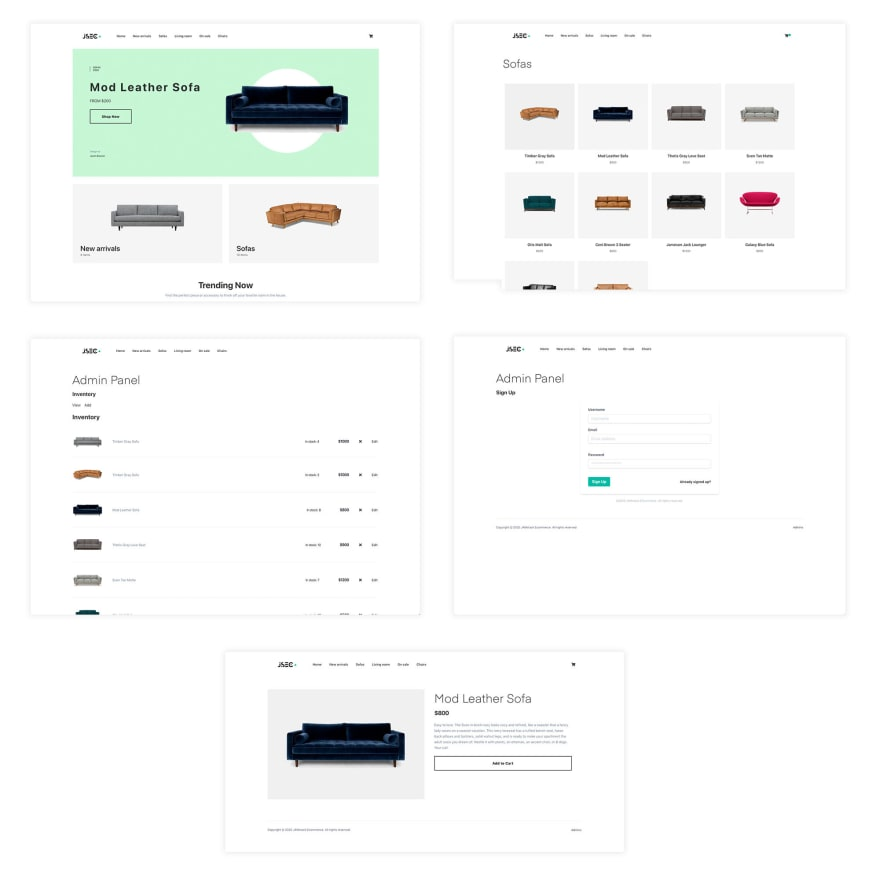
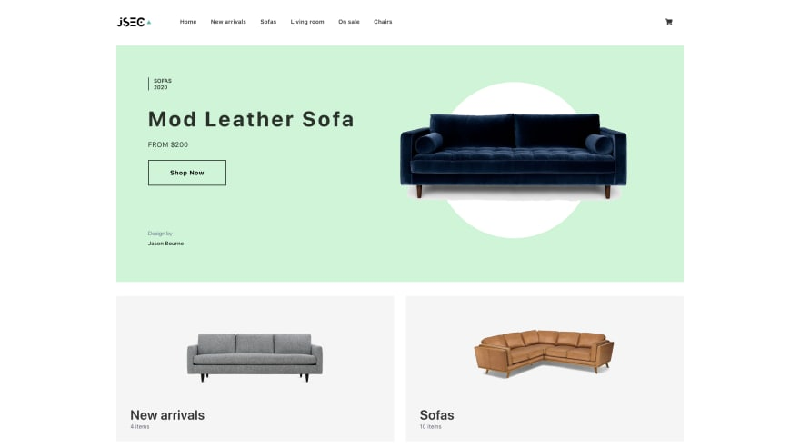

While this post focuses on the specific use case of building an ECommerce application, the services and features I will showcase are the building blocks for most all real-world production applications, so I hope you will find it useful.
 
### Laying the groundwork

For this site, I've chosen to use [Gatsby](https://gatsbyjs.org/) in order to get the benefits of a static site, including better performance, better SEO, and cheaper / easier scalability. Next.js (React) and Nuxt (Vue) are other options that would do the job just as well, but I've gone with Gatsby because of my previous experience with it as well as the robust developer community and documentation available at the time of this writing.

The app we will be building has the following features:

1. Ability to query inventory from an API
2. At build time, create navigation based on inventory categories
3. At build time, create pages for each inventory item and category pages for each nav item along with corresponding views
4. Shopping cart / checkout
5. Admin panel for creating / updating inventory
6. Downloading of images at build time to serve from the public folder vs dynamic fetching

Based on these features, we can assume that the app will have the following requirements from an API / service standpoint:

1. Authentication (sign up, sign in)
2. Dynamic group authorization (only Admin users can view and update inventory)
3. API with create, update, and delete operations
4. Public API access for querying the API
5. Private API access so that only Admin users can create / update / delete inventory
6. Image / asset hosting

To build out these features on both the front and the back end we will be using the Amplify Framework:

**Amplify CLI**- for creating and configuring AWS services

**Amplify Client**- libraries for interacting with the services

**Amplify Console** - to host and view the app and features after they are deployed.

Let’s start building!

To follow along with this tutorial, you need to have an AWS account (sign up here)[https://aws.amazon.com/premiumsupport/knowledge-center/create-and-activate-aws-account/]

## Getting started

To get started, clone the [Gatsby JAMstack ECommerce starter project](https://github.com/jamstack-cms/jamstack-ecommerce) that will serve as the base of the application we'll be building:

```
$ git clone https://github.com/jamstack-cms/jamstack-ecommerce.git
```
Next, change into the directory and install the dependencies using npm or yarn:

```
$ cd jamstack-ecommerce


$ npm install

# or

$ yarn
```

Next, start the project to get an idea of how the app will look:
```
$ gatsby develop
```

When the app loads, you should be able to go to `http://localhost:8000/` and see something like this:


Great, we're now up and running!

You may be wondering where the inventory is coming from. Starting off, the inventory is hard-coded in the inventory file located at providers/inventory.js.

This is not ideal though because keeping up with everything locally is hard to scale. Instead, we propose to make the inventory dynamic and be able to add and update inventory via and admin panel using some type of content management system.

To do so, we'll need to set up an API. To start, create the Amplify project so we can begin migrating the inventory provider to a real back end provider.

## Installing Amplify and initializing an Amplify project

Before you can use Amplify, you'll first need to have or [create an AWS Account](https://aws.amazon.com/resources/create-account/).

Next, install the Amplify CLI globally from the command line:

```
$ npm install -g @aws-amplify/cli
```
If the CLI is installed, you should be able to run the amplify command and see some output and help options.
```
$ amplify
```
Now that the CLI is successfully installed, we now need to configure the CLI. To do so, run the configure command:
```
$ amplify configure
```
This will walk you through the steps to create and configure AWS user credentials locally. For a guided walkthrough of these configuration steps, check out this [video](https://www.youtube.com/watch?v=n4DuYTzpvdE).

## Creating the Amplify project

After the CLI has been configured you can create a new Amplify project:
```
$ amplify init

? Enter a name for the project: jamstack-ecommerce
? Enter a name for the environment dev
? Choose your default editor: <your_preferred_editor>
? Choose the type of app that youre building: javascript
? What javascript framework are you using: react
? Source Directory Path: src
? Distribution Directory Path: public
? Build Command: gatsby build
? Start Command: npm run start
```

>When prompted for an AWS profile, choose the profile you created in the configuration step.
After the initialization has been completed, you should now see 2 artifacts created for you in your project directory:

**1.src/aws-exports.** - This file will hold the key value pairs of the resource information for the services created by the CLI.

**2.amplify directory** - This will hold the back end code we write for things like GraphQL schemas and serverless functions managed by the AWS services we'll be using.

Now that we have the base project set up, let's also go ahead and install the AWS Amplify client library:
```
$ npm install aws-amplify

# or

$ yarn add aws-amplify
```
## Creating the back end services

Now we are ready to go and can start creating the services we'll be integrating into the app. Let's first start with authentication.

### Authentication

The authentication setup for this app will need to accomplish the following things:

Enable users to sign up and sign in
1. Detect Admin users based on a predetermined list of admins and place them in the Admin group once they sign up.
2. We can do this with a combination of [Amazon Cognito](https://aws.amazon.com/cognito/) (managed authentication service) and [AWS Lambda](https://aws.amazon.com/lambda/) (functions as a service).

We'll create an authentication service that will call (trigger) a Lambda function when someone signs up (post-confirmation). In that function we can determine whether or not they will be allowed Admin access based on their email address.

To create the service, we'll use the Amplify add command:
```
$ amplify add auth

? Do you want to use the default authentication and security configuration? Default configuration
? How do you want users to be able to sign in? Username
? Do you want to configure advanced settings? Yes
? What attributes are required for signing up? Email (keep defaults)
? Do you want to enable any of the following capabilities? Add User to Group
? Enter the name of the group to which users will be added. Admin
? Do you want to edit your add-to-group function now? Y
```
Now, let's edit the code for the post-confirmation Lambda trigger. In amplify/backend/function/function_name/src/add-to-group.js, use the following code:

```javascript
// amplify/backend/function/function_name/src/add-to-group.js
const aws = require('aws-sdk');

exports.handler = async (event, context, callback) => {
  const cognitoidentityserviceprovider = new aws.CognitoIdentityServiceProvider({ apiVersion: '2016-04-18' });

  // Here, update the array to include the Admin emails you would like to use
  let adminEmails = ["dabit3@gmail.com"], isAdmin = false

  if (adminEmails.indexOf(event.request.userAttributes.email) !== -1) {
    isAdmin = true
  }

  if (isAdmin) {
    const groupParams = {
      GroupName: process.env.GROUP, UserPoolId: event.userPoolId,
    };

    const addUserParams = {
      ...groupParams, Username: event.userName,
    };

    try {
      await cognitoidentityserviceprovider.getGroup(groupParams).promise();
    } catch (e) {
      await cognitoidentityserviceprovider.createGroup(groupParams).promise();
    }

    try {
      await cognitoidentityserviceprovider.adminAddUserToGroup(addUserParams).promise();
      callback(null, event);
    } catch (e) {
      callback(e);
    }
  } else {
    callback(null, event);
  }
};
```
Update the adminEmails array to include the emails you'd like to allow Admin access.

This function will add a user to the Admin group if their email is included in the adminEmails array.

## Storage

Next, let's create the image storage service using Amazon S3:

