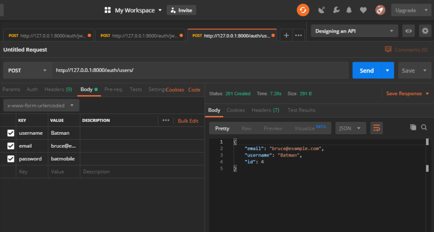
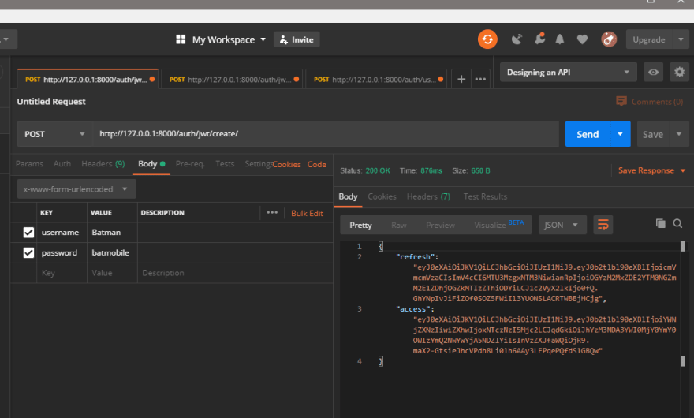
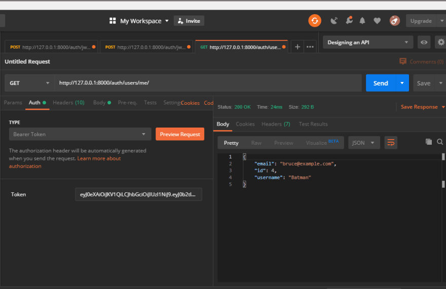
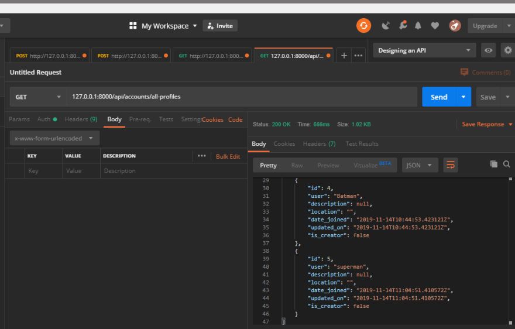
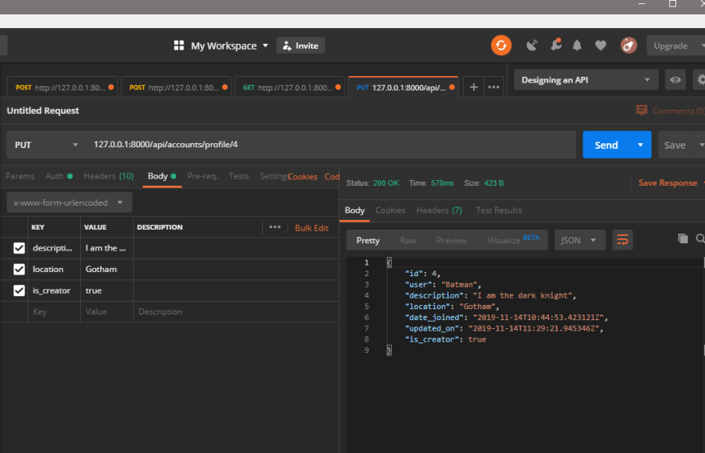

Will be making web APIs with the popular python web framework, Django.

You've probably heard that the best way to learn is by doing. So in this walkthrough, we'll be building a RESTful API with Django and the django rest framework. The project will be an event scheduler application, similar to meetup.com.

Key features will be users to create events and other registered users can mark attendance to the created events. We'll also explore how to review an event, putting in place checks to ensure only those members who attended the event can review any given event. Hopefully, by the end of the series, you too can apply some of the concepts here to build your own REST APIs with Django.

You'll find the project's code my [github](https://github.com/jeffubayi/Events-Organizer).

## Introduction and project setup.

  - User registration,authetication and authorization with djoser and JSON web tokens(JWTs).
  - Events creation and attendance endpoints.

I'll try to follow a similar structure in this. This will mainly involve:

    1. Model creation.
    2. Serializers, API views and modifying them to suit our needs.
    3. Creating permission classes for our endpoints.
    4. Writing automated unit tests for the endpoints.
    5. Demo with postman.

## Project setup

For this project, we'll need to have python 3+ installed. You can find the necessary steps here.
Next, we'll need to make virtual environments for installing project dependencies.

Install virtualenv

     `pip install virtualenv`

Create a new virtualenv

     `virtualenv yourenvname -p python3.6`

Activate virtual environment

     `source yourenvname/bin/activate`

Run this command within the directory the virtual environment was created in.

## Dependencies

1. Django and the Django rest framework

     `pip install django djangorestframework`

2. Djoser: REST implementation of Django authentication system. The Djoser library provides a set of Django Rest Fr amework views and endpoints to handle basic actions such as registration, login, logout, password reset, and account activation

      `pip install djoser`

3. django-rest-framework-simplejwt: provides a JSON Web Token authentication backend for the Django REST Framework.

     `pip install djangorestframework_simplejwt`

Typically, if you have a lot of project dependencies in python, it's advisable to put them in a requirements.txt file and install them with one command.

     `pip install -r requirements.txt`

To kick off the new django project, run the following once you've activated the previously created virtual environment.

     `django-admin startproject eventScheduler`

Now to start with the first app that we'll be requiring for the next section:

     `cd eventScheduler`
     `python manage.py startapp accounts `

If you've followed the steps along, our app should now be having its structure as

```python
./eventScheduler
├── accounts
│   ├── admin.py
│   ├── apps.py
│   ├── __init__.py
│   ├── migrations
│   │   └── __init__.py
│   ├── models.py
│   ├── tests.py
│   └── views.py
├── eventScheduler
│   ├── __init__.py
│   ├── __pycache__
│   │   ├── __init__.cpython-35.pyc
│   │   └── settings.cpython-35.pyc
│   ├── settings.py
│   ├── urls.py
│   └── wsgi.py
└── manage.py
```

Next we'll be going through user registration with the django rest framework and utilizing JSON web tokens for authorization. We'll also be extending the default User model that ships with django so as to allow us to capture more details about our system's users.

## What is a JSON Web token?
JSON Web Token (JWT) is an Internet standard for creating JSON-based access tokens that assert some number of claims. For example, a server could generate a token that has the flag "logged in as admin" or "logged in like this user" and provide that to a client. The client could then use that token to prove that it is logged in as admin. The tokens are signed by one party's private key (usually the server's) so that both parties can verify that the token is legitimate. The tokens are designed to be compact, URL-safe, and usable especially in a web-browser single-sign-on (SSO) context. JWT claims can be typically used to pass the identity of authenticated users between an identity provider and a service provider.
Unlike token-based authentication, JWTs are not stored in the application's database. For a more in-depth explanation of how the JWTs work, check out this awesome video.


## Project set up
Before proceeding, let's take a look at some of the endpoints we'll be utilizing in this section.


| Endpoint   | Description  |
--- | --- | 
/auth/users/  |  Register a new user                                                         
/auth/users/me/	 | retrieve/update the currently logged in user                                
/auth/jwt/create/ | create a JWT by passing a valid user in the post request to this endpoint   
/auth/jwt/refresh/	| get a new JWT once the lifetime of the previously generated one expires     
/api/accounts/all-profiles/ |	get all user profiles and create a new one                                 
/api/accounts/profile/id/  | detail view of a user's profile   


Those may seem like a handful but the good news is that djoser has done most of the heavy lifting for us. All the endpoints starting with auth are djoser generated.

Getting back to the first part of the series, we installed some python packages. We'll need to add those packages to the project's settings.py file so as to utilize them in our django project.

```python
INSTALLED_APPS = [
	#our first django app
    'accounts',
    'django.contrib.admin',
    'django.contrib.auth',
    'django.contrib.contenttypes',
    'django.contrib.sessions',
    'django.contrib.messages',
    'django.contrib.staticfiles',
	
	#third party package for user registration and authentication endpoints 	
    'djoser',
	
     #rest API implementation library for django
    'rest_framework',
	
	#JWT authentication backend library
    'rest_framework_simplejwt',
]
```

Don't forget to change the authentication settings for DRF to reflect the usage of JWTS.

```python
REST_FRAMEWORK = {
    'DEFAULT_AUTHENTICATION_CLASSES': (
        'rest_framework_simplejwt.authentication.JWTAuthentication',
    ),
}
```
With this system set up, it's important to register routes for the endpoints that'll be used within the project. By registering the paths to the project's main urls.py file we can access the different endpoints we'll need later on.

```python
from django.contrib import admin
from django.urls import path,include

urlpatterns = [
    path('admin/', admin.site.urls),
	
	#path to djoser end points
    path('auth/', include('djoser.urls')),
    path('auth/', include('djoser.urls.jwt')),
	
	#path to our account's app endpoints
    path("api/accounts/",include("accounts.urls"))
]
```

## User profile model

Django ships with a default user model with fields like username, passwords and email input, in some cases, however, these fields may not be enough prompting us to extend the model or create your custom user model. In this case, we'll be extending the user model because we need to have a way to differentiate users. There'll be two user types. Those that can organize events and those that just want to attend events.

```python
from django.db import models
from django.contrib.auth.models import User
# Create your models here.

class userProfile(models.Model):
    user=models.OneToOneField(User,on_delete=models.CASCADE,related_name="profile")
    description=models.TextField(blank=True,null=True)
    location=models.CharField(max_length=30,blank=True)
    date_joined=models.DateTimeField(auto_now_add=True)
    updated_on=models.DateTimeField(auto_now=True)
    is_organizer=models.BooleanField(default=False)

    def __str__(self):
        return self.user.username
```

We'll also create a post_save signal to automatically create the user profile for new users that register to the platform.
For this, create a signals.py file and write the code below.

```python
from django.contrib.auth.models import User
from django.db.models.signals import post_save
from django.dispatch import receiver

from .models import userProfile


@receiver(post_save, sender=User)
def create_profile(sender, instance, created, **kwargs):
    if created:
        userProfile.objects.create(user=instance)
```

For a detailed explanation on how signals work, [this](https://docs.djangoproject.com/en/2.2/topics/signals/) is a good starting place
Don't forget to register the signal in your app.py file like so:

```python
from django.apps import AppConfig


class AccountsConfig(AppConfig):
    name = 'accounts'

    def ready(self):
        import accounts.signals
```

## Serializers

With the basic set up out of the way, let's get to the API implementation.
If you are new to django, serializers allow complex data such as querysets and model instances to be converted to native python data types that can be easily rendered to formats like JSON. This is called serialization. They also allow deserialization after first validating incoming request data.

Within the app's directory, we'll initiate a serializers.py file and input the code below:

```python
from rest_framework import serializers
from .models import userProfile
class userProfileSerializer(serializers.ModelSerializer):
    user=serializers.StringRelatedField(read_only=True)
    class Meta:
        model=userProfile
        fields='__all__'
```

Going line by line, what we did is import the serializers class from rest_framework as well as the model we want to serialize. In this case, it's the userProfile model.

Our first serializer is userProfileSerializer. This will inherit from the ModelSerializer class in django. As you noted before, the userProfile model was linked to the default user model in django. We'll indicate this field as read_only. This means that the field will be included in the APIs output but won't be included during Create or Update operations on the endpoint. To populate this field, we'll create a method to automatically fill the field with the request user.

There are other serializer types in rest_framework such as ListSerializer and HyperlinkedModelSerializer. For a comprehensive guide on the serializers, the rest framework docs are a great place to start.

## API views

To access data in an API, we use endpoints. This are basically URL routes. How django works is that each url is linked to a controller called a view. The controllers can either be class based or function based.
After routing has determined which controller to use for a request, your controller is responsible for making sense of the request and producing the appropriate output.

One implementation of this controller in rest framework are the generic views. These were developed as a shortcut for common usage patterns. They take certain common idioms and patterns found in view development and abstract them so that you can quickly write common views of data without having to repeat yourself.
Some of these views are CreateAPIView, ListAPIView, ListCreateAPIView, RetrieveUpdateDestroyAPIView and the list goes on.

We'll implement the ListCreateAPIView and RetrieveUpdateDestroyAPIView.

```python
from rest_framework.generics import (ListCreateAPIView,RetrieveUpdateDestroyAPIView,)
from rest_framework.permissions import IsAuthenticated
from .models import userProfile
from .permissions import IsOwnerProfileOrReadOnly
from .serializers import userProfileSerializer

# Create your views here.

class UserProfileListCreateView(ListCreateAPIView):
    queryset=userProfile.objects.all()
    serializer_class=userProfileSerializer
    permission_classes=[IsAuthenticated]

    def perform_create(self, serializer):
        user=self.request.user
        serializer.save(user=user)


class userProfileDetailView(RetrieveUpdateDestroyAPIView):
    queryset=userProfile.objects.all()
    serializer_class=userProfileSerializer
    permission_classes=[IsOwnerProfileOrReadOnly,IsAuthenticated]
```

Each API view is linked to the serializer class we had previously created.
One thing we notice is the `perform_create` method in the `UserProfileListCreateView` class. 
This is how we indicate how we want to create the serializer. In this case, we wanted to populate the `read_only` user field with the requesting user then populate the serializer with this value.

The views are then linked to a URL endpoint in the app's urls.py file:

```python
from django.urls import include, path
from rest_framework.routers import DefaultRouter

from .views import UserProfileListCreateView, userProfileDetailView

urlpatterns = [
    #gets all user profiles and create a new profile
    path("all-profiles",UserProfileListCreateView.as_view(),name="all-profiles"),
   # retrieves profile details of the currently logged in user
    path("profile/<int:pk>",userProfileDetailView.as_view(),name="profile"),
]
```

## Permissions

Permissions determine whether a request should be granted or denied access.
Django rest framework ships with several. I won't get into those as it's documentation is quite comprehensive about them.
However, let's draw our attention to the `IsOwnerProfileOrReadOnly`  permission class.

This is a custom permission implementation. We'll initialize a permission.py file and populate it with the code below:

```python
from rest_framework.permissions import BasePermission,SAFE_METHODS

class IsOwnerProfileOrReadOnly(BasePermission):
    def has_object_permission(self, request, view, obj):
        if request.method in SAFE_METHODS:
            return True
        return obj.user==request.user
```

By overriding the BasePermission class, we can create our own permission. This class has two methods that we can override.
`.has_permission()` and `.has_object_permission()`
Both must return True if a request is to be granted and False if the request is denied. `SAFE_METHODS` are `GET`, `OPTIONS`, and `HEAD`.

In our custom permission class, we are checking if the requesting user is similar to the object's user field. This will ensure that a profile owner is the only one that can change their information.

## API tests

Almost done now 🤣. We'll write some tests to ensure our endpoints are working as required.

```python
class userProfileTestCase(APITestCase):
    profile_list_url=reverse('all-profiles')
    def setUp(self):
        # create a new user making a post request to djoser endpoint
        self.user=self.client.post('/auth/users/',data={'username':'mario','password':'i-keep-jumping'})
        # obtain a json web token for the newly created user
        response=self.client.post('/auth/jwt/create/',data={'username':'mario','password':'i-keep-jumping'})
        self.token=response.data['access']
        self.api_authentication()

    def api_authentication(self):
        self.client.credentials(HTTP_AUTHORIZATION='Bearer '+self.token)

    # retrieve a list of all user profiles while the request user is authenticated
    def test_userprofile_list_authenticated(self):
        response=self.client.get(self.profile_list_url)
        self.assertEqual(response.status_code,status.HTTP_200_OK)

    # retrieve a list of all user profiles while the request user is unauthenticated
    def test_userprofile_list_unauthenticated(self):
        self.client.force_authenticate(user=None)
        response=self.client.get(self.profile_list_url)
        self.assertEqual(response.status_code,status.HTTP_401_UNAUTHORIZED)

    # check to retrieve the profile details of the authenticated user
    def test_userprofile_detail_retrieve(self):
        response=self.client.get(reverse('profile',kwargs={'pk':1}))
        # print(response.data)
        self.assertEqual(response.status_code,status.HTTP_200_OK)


    # populate the user profile that was automatically created using the signals
    def test_userprofile_profile(self):
        profile_data={'description':'I am a very famous game character','location':'nintendo world','is_creator':'true',}
        response=self.client.put(reverse('profile',kwargs={'pk':1}),data=profile_data)
        print(response.data)
        self.assertEqual(response.status_code,status.HTTP_200_OK)
```

To run the tests, run the command 

`python manage.py test`

in your terminal.

If you are feeling a bit confused, here's the project structure up to this point.

```python
eventScheduler  
├── accounts    
│   ├── admin.py
│   ├── apps.py
│   ├── __init__.py
│   ├── migrations     
│   │   └── __init__.py
│   ├── models.py      
│   ├── permissions.py 
│   ├── serializers.py 
│   ├── tests.py       
│   ├── urls.py        
│   └── views.py       
├── eventScheduler     
│   ├── __init__.py
│   ├── __pycache__
│   │   ├── __init__.cpython-35.pyc
│   │   └── settings.cpython-35.pyc
│   ├── settings.py
│   ├── urls.py
│   └── wsgi.py
└── manage.py
```

## 5.Demo with postman

### User registration



Get access token



### Retrieve/update the authenticated user.

We'll be passing the get request as the user Batman. To do this, every post request must have a JWT to identify the user as a valid user. In post man, we can place the token in the auth section and indicating you want to use a Bearer token. You'll then paste in the access token generated above.



### Get all user Profiles
This will be through a GET request.



## Update authenticated User

### Through a PUT request



That's the end of this looong post 👀. I hope with this information you too can make your own RESTful API with django.
If you have any questions, feel free to email me. You can also contact me on twitter.

Thanks for going through this article👨💻.
