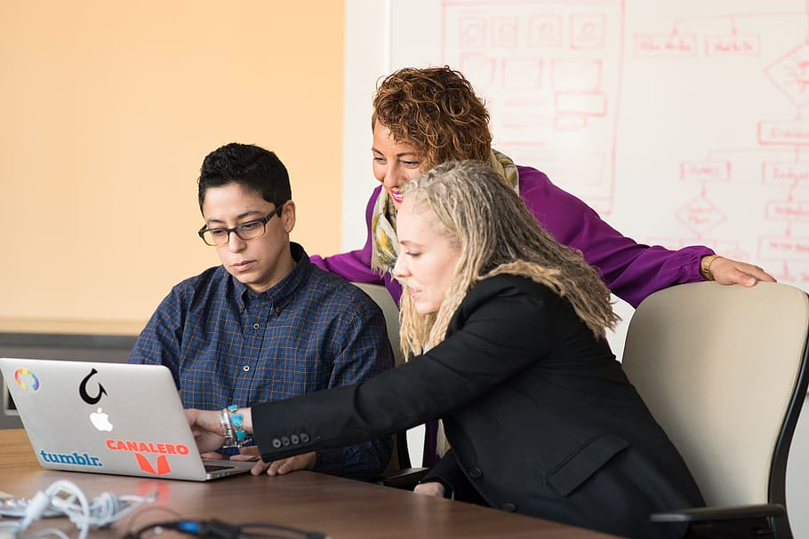

Helping people not only benefits your workmates but also benefits you. Even more than them. It is a concept called ‘Learning by Teaching‘.

Yes, I know that it sounds counter-intuitive, but let’s see what you get by helping others:

## 1.Reinforcing what you already know
When you explain how to do things, even more, why, when and the best way to do things, you reinforce what you already know.

Sometimes, you get questions that you don’t know how to answer them, just because you never did that specific thing or you forgot about it. Then it is time to do a bit of research and…

## 2.Fill holes in your knowledge
Let’s say a person you work with asks you to set up a BackEnd with some async methods in Django using Celery and Redis. And you never did that before.

Then you have to do all the stuff: Reading the docs, posts, studying Github code…

As everything is new for you, you will have a hard time learning concepts you never used before. But that’s what pushes you forward in your career: Doing the hard, scary, new stuff.

## 3.Helps you to understand people better
By helping other people, you understand them better. You know not only what they know, but also how they think, how they learn, how they feel.

There is a lack of empathy in most of the developers I meet. I can’t put my finger on the reason, but most developers I know have an “It’s every man for himself” mentality.

By helping other people, you reconnect a bit more with people, after spending hours and hours with the computer alone every day :).

## Conclusion
Teamwork teamplayer
Helping each other has only advantages (Solving your problems faster, you reinforce what you know, they will be more prone to help you in the future, etc) and no drawbacks.

Refusing to help and looking down on people asking you for help doesn’t help you on the slightest. Now one is going to think “Wow, that person is so knowledgeable that, in order to help you, has to descend into the humankind”. Probably they will think that you are a pretentious prick.

That’s what I did when it happened to me.

So, help others, help yourself and help your company, and help people struggling: It could be you. And one day you’ll be.

Even if you think you won’t.

